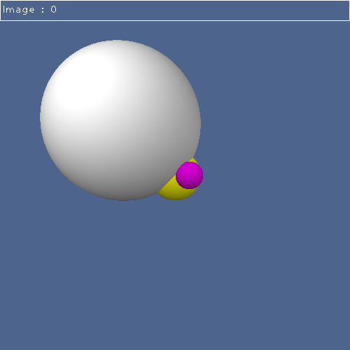

# Raytracer
A C++11 raytracer built for the Digital imaging course at ESIEA.
The goals of the project are :
 - [x] Perform raytracing on a 3D scene with Blinn-Phong illumination
 - [ ] Support at least spheres, planes and triangles
 - [x] Save the resulting image into a file

Current state of the software : 

## Building
The project is tested with Visual Studio 2017 Community.

## Dependencies
*OpenCV* is used to display and save the resulting images so you will have to include it in the project. The projects are already configured to use an `OpenCV` directory located among the other project directories.